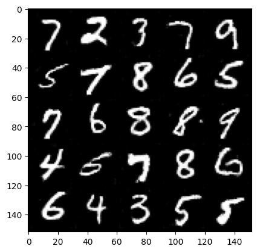

# Conditional GAN for MNIST Image Data Generation

This repository contains an implementation of a Conditional Generative Adversarial Network (GAN) for generating images from the MNIST dataset. The network is built using PyTorch and is trained to generate digit items conditioned on class labels (e.g., 1, 2, 3). The project builds on the foundational concepts of GANs, with a specific focus on **Conditional GANs (CGANs)**, where class information is incorporated into both the generator and discriminator.

## Project Overview

Generative Adversarial Networks (GANs) consist of two networks: 
1. **Generator** - tasked with generating fake images.
2. **Discriminator** - tasked with distinguishing real images from generated ones.

In this project, I extend a basic GAN by conditioning it on class labels. This allows the generator to not only produce random images but also to generate images that belong to specific classes from the MNIST dataset.

### Key Features
- **Conditional GAN**: The generator and discriminator take class information as input to control the type of images generated.
- **One-Hot Encoding**: Class labels are one-hot encoded and concatenated with noise to form the generator’s input.
- **Training on MNIST**: The network is trained on the 10-class MNIST dataset, generating digits as per the item.

## Dataset Description
The project uses the MNIST dataset, a widely used benchmark dataset for handwritten digit classification. It consists of 70,000 grayscale images of handwritten digits (0-9), each of size 28x28 pixels.

## Model Architecture

### Generator
- Takes random noise (`z_dim`) and class information as input.
- Produces 28x28 grayscale images, conditioned on the specified class.

### Discriminator
- Receives both real and generated images along with class information.
- Outputs the likelihood that the input image is real or fake.

## Code Breakdown

### 1. **Data Preparation**
The MNIST dataset is loaded, and the class labels are one-hot encoded to be used as inputs for both the generator and discriminator.

### 2. **Model Definition**
The architecture of both the generator and discriminator is defined. The generator creates images by upsampling noise and class information, while the discriminator evaluates them alongside real images.

### 3. **Training**
The models are trained adversarially: 
- The generator tries to fool the discriminator, 
- The discriminator learns to distinguish real images from generated ones.

### 4. **Evaluation**
Generated images are evaluated based on their resemblance to real MNIST images and their adherence to the specified class labels.

## How to Run

1. Clone this repository:
   ```bash
   git clone https://github.com/yourusername/conditional_gan_fashionmnist.git
   ```

2. Install the required dependencies:
   ```bash
   pip install -r requirements.txt
   ```

3. Train the Conditional GAN:
   ```bash
   python train.py
   ```

4. Generate images:
   After training, you can generate images conditioned on specific classes and optionally interpolate between two classes. To generate an image for a specific class, use the following command:

   ``` bash
   python generate.py --class_id 0  # Generates a digit for class 0
   ```
   To interpolate between two classes, use the --interpolate flag:
   
   ``` bash
   python generate.py --class_id 0 --class_id 1 --interpolate  # Interpolates between class 0 and class 1
   ``` 
   By default, generated images will be saved in the output folder specified in the code.

#### Using the Jupyter Notebook:

A Jupyter notebook is also included for training and generating images interactively. To run the notebook:

 - Open the GAN_MNIST_Generation.ipynb file in Jupyter or Jupyter Lab.
 - Follow the cells to train the model and generate images.
 - The notebook also supports interpolation between classes, and includes additional visualizations.

## Results

After training, the generator can produce images of digits based on the class input. Below are some sample outputs after training the network for 100 epochs:



## Repository Structure

- `train.py`: Script for training the Conditional GAN.
- `generate.py`: Script to generate images based on the trained model.
- `model.py`: Contains the definition of the generator and discriminator.
- `utils.py`: Utility functions such as one-hot encoding and input dimension calculations.
- `README.md`: This file.

## Future Work

- Implement more advanced architectures like StyleGAN.
- Explore training on higher-resolution image datasets.
- Experiment with different GAN loss functions.

## License

This project is licensed under the MIT License.
